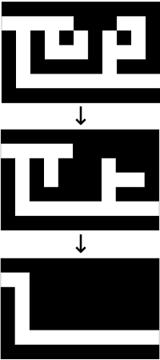
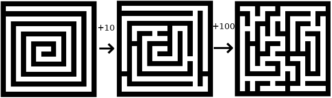

# Maze-Transmuting Algorithms

##### Go back to the main [README](../README.md)

## Cul-de-sac Filler

###### The Algorithm

1. Scan the maze, looking for cells with connecting halls that go in exactly two directions.
2. At each of these places, travel in both directions until you find your first intersection.
3. If the first intersection for both paths is the same, you have a loop.
4. Fill in the cell you started at with a wall, breaking the loop.

###### Results

* This works great for simple loops, and even multi-loops. It would probably fail for big, empty rules.

###### Notes

This is a classic algorithm. However, it seems fairly slow by design. Still, if your maze has many cul-de-sacs / loops it could be very helpful.

## Dead End Filler

###### The Algorithm

1. Scan the maze in any order, looking for dead ends.
2. Fill in each dead end, and the dead-end passages attached to them.

###### Results

* Run this algorithm enough times on a perfect maze and it will leave only the solution cells open!

###### Notes

If you generate a maze which is just *all* loops (called a heavily braided maze), this algorithm won't do much. But it nearly all other scenarios it works like a charm.

## Perturbation

###### The Algorithm

1. Start with a complete, valid maze.
2. Add a small number of random walls, blocking current passages.
3. Go through the maze and reconnect all passages that are not currently open, by randomly opening walls.
4. Repeat steps 3 and 4 a prescribed number of times.

###### Optional Parameters

* *new_walls*: Integer [1, 2, ...]
 * The number of randomly positioned new walls you create throughout the maze. (default 1)
* *repeat*: Integer [1, 2, ...]
 * The number of times sets of new walls will be added to the maze; the maze being fixed after each set. (default 1)

###### Results

This usually produces perfect mazes (if the input maze was perfect). But there is a small chance that not all inner walls of the maze will be fully connected.

###### Notes

In math and physics, perturbation theory is idea that you can solve a new problem by starting with the known solution to an old problem and making a small change. Here, we take a previously-generated maze and perturb it slightly by adding a couple walls, then re-open any parts of the maze we have closed off. This is an amazingly powerful tool. It can fix nearly any flaw in a maze. Or you can start with a non-maze, say a nice spiral or a cute drawing, and turn it into a maze using first-order perturbations.

With great power comes great responsibility. If you use this method on a grid that does not contain a maze, it will fail. If you run too many iterations of this algorithm, your end maze will look nothing like the original. But if used wisely, this is an extremely powerful tool.

## Vocabulary

1. __cell__ - an open passage in the maze
2. __grid__ - the grid is the combination of all passages and barriers in the maze
3. __perfect__ - a maze is perfect if it has one and only one solution
4. __wall__ - an impassable barrier in the maze

##### Go back to the main [README](../README.md)
